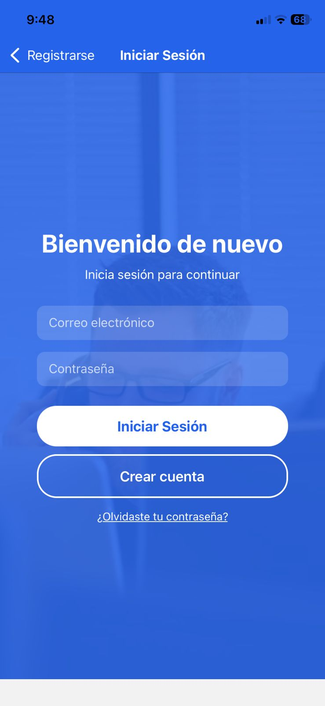
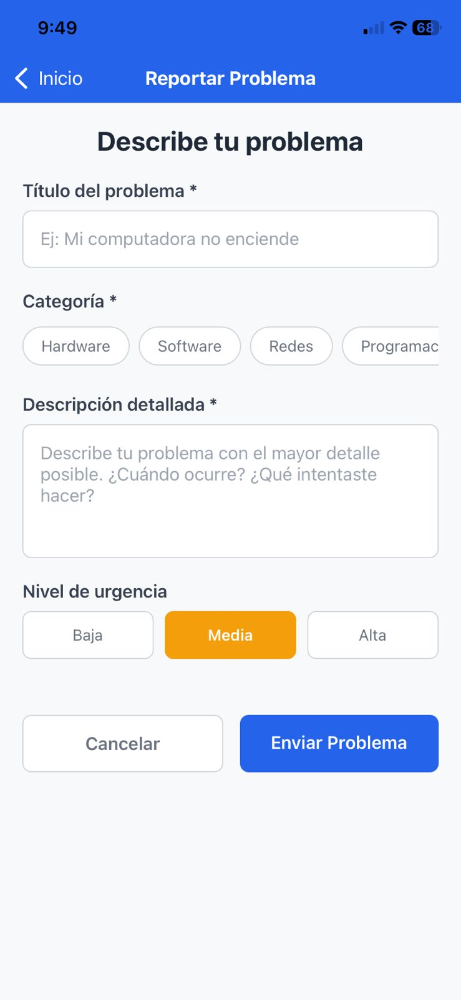
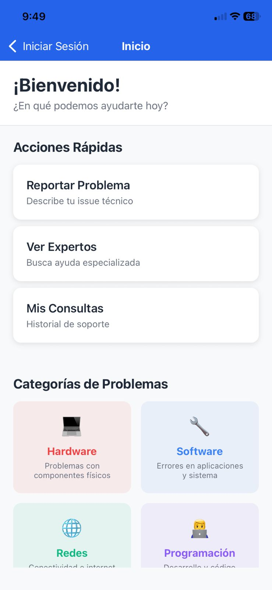

# 🛠 TechSupport  

Aplicación móvil desarrollada en *React Native* con *MongoDB* como base de datos.  
TechSupport permite a los usuarios *reportar incidencias, **dar seguimiento a tickets* y *conectarse con técnicos de soporte* de manera sencilla desde Android o iOS.  

---

## 🚀 Características principales  
- 📱 *Login y registro* de usuarios con autenticación segura  
- 📝 Creación, asignación y seguimiento de *tickets de soporte*  
- 🔔 Notificaciones en tiempo real (Firebase)  
- 👨‍💻 Panel para técnicos con estado de incidencias  
- 🌐 Disponible para *Android e iOS*  

---

## 🛠 Tecnologías utilizadas  

### 🔹 Frontend  
  
  
  

### 🔹 Backend  
  
  

### 🔹 Base de datos  
  

### 🔹 Otras herramientas   
  
  
  

---

## 📸 Capturas de pantalla  

| Login | Dashboard | Ticket |
|-------|-----------|--------|
|  |  |  |

---

## 📅 Detalles del Sprint 1

En el primer sprint se trabajó en:

## 🔗 Integración con la base de datos (MongoDB):
Se implementó la conexión entre el backend en Node.js + Express y la base de datos MongoDB, lo que permitió el manejo de usuarios.

## 📱 Compatibilidad multiplataforma (Android e iOS):
Se realizaron configuraciones y pruebas para asegurar que la aplicación pudiera ejecutarse correctamente en ambos sistemas operativos, incluyendo la instalación de dependencias específicas y la validación en emuladores.

---

## ⚙ Instalación y configuración  

1. Clonar el repositorio

git clone https://github.com/TU_USUARIO/TechSupport.git
cd TechSupport

2. Instalar dependencias

npm install

o con yarn

yarn install

3. Configurar variables de entorno
Crear un archivo .env en la raíz con:

PORT=3000
MONGO_URI=mongodb://localhost:27017/techsupport
JWT_SECRET=tu_secreto_aqui

4. Iniciar la app en Android

npx react-native run-android

5. Iniciar la app en iOS

npx react-native run-ios

6. Iniciar el backend local si aplica

node server.js

7. Abrir la app en el emulador o dispositivo físico y probar
